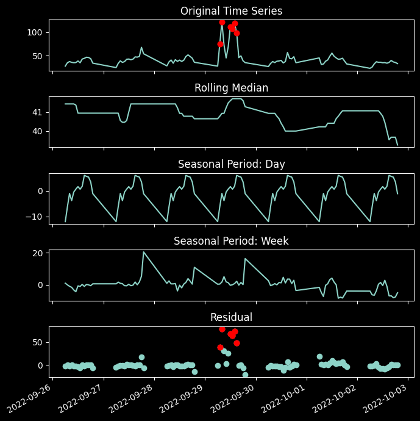
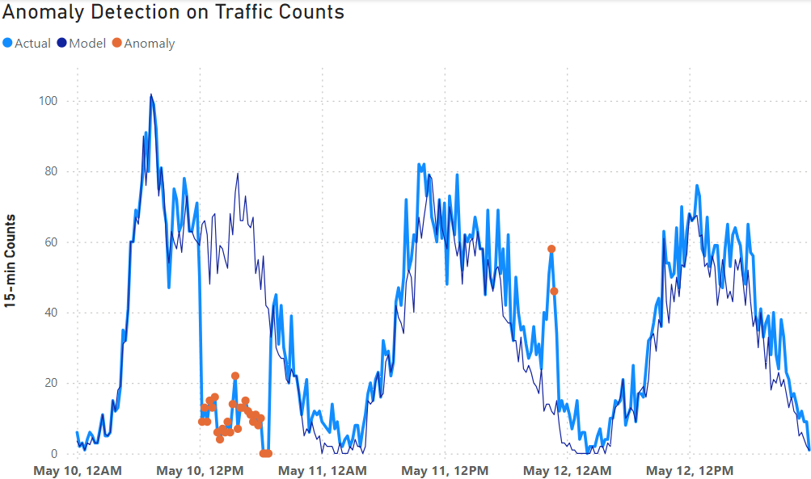
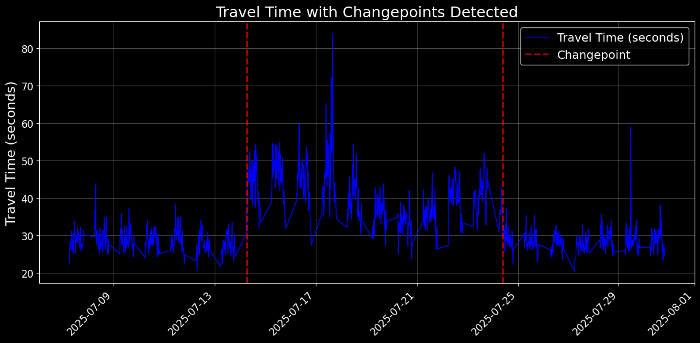

# Traffic Anomaly

<!-- Package Info -->
[](https://pypi.org/project/traffic_anomaly/)
[](https://pypi.org/project/traffic_anomaly/)
[](https://pepy.tech/project/traffic-anomaly)

<!-- Repository Info -->
[](https://github.com/ShawnStrasser/traffic-anomaly/blob/main/LICENSE)
[](https://github.com/ShawnStrasser/traffic-anomaly/issues)
[](https://github.com/ShawnStrasser/traffic-anomaly/stargazers)

<!-- Status -->
[](https://github.com/ShawnStrasser/traffic-anomaly/actions/workflows/pr-tests.yml)
[](https://codecov.io/gh/ShawnStrasser/traffic-anomaly)

`traffic-anomaly` is a production-ready Python package for robust anomaly and changepoint detection across multi-entity time series. It uses Ibis to integrate with any SQL backend in the cloud or run locally with the included DuckDB backend.

**Tested on:** Windows, macOS, and Ubuntu with Python 3.9-3.13

Designed for real-world traffic data (volumes, travel times), `traffic-anomaly` uses medians to decompose series into trend, daily, weekly, and residual components. Anomalies are then classified via Z-score or GEH statistics and change points highlight structural shifts. The package handles missing data and can drop time periods with insufficient observations. Sample data included, try it in Google Colab for detailed examples and explanations. [](https://colab.research.google.com/drive/1ktJfanOpRJ8jelc7w4nSDizj7SGwhScr?usp=sharing)


## Installation

```bash
pip install traffic-anomaly
```

## Usage

```python
from traffic_anomaly import *
from traffic_anomaly import sample_data

# Load sample data
travel_times = sample_data.travel_times

decomp = decompose(
    data=travel_times, # Pandas DataFrame or Ibis Table (for compatibility with any SQL backend)
    datetime_column='timestamp',
    value_column='travel_time',
    entity_grouping_columns=['id', 'group'],
    freq_minutes=60, # Frequency of the time series in minutes
    rolling_window_days=7, # Rolling window size in days. Should be a multiple of 7 for traffic data
    drop_days=7, # Should be at least 7 for traffic data
    min_rolling_window_samples=56, # Minimum number of samples in the rolling window, set to 0 to disable.
    min_time_of_day_samples=7, # Minimum number of samples for each time of day (like 2:00pm), set to 0 to disable
    drop_extras=False, # lets keep seasonal/trend for visualization below
    return_sql=False # Return SQL queries instead of Pandas DataFrames for running on SQL backends
)
decomp.head(3)
```
| id         | timestamp           | travel_time | group           | median    | season_day | season_week | resid      | prediction |
|------------|---------------------|-------------|-----------------|-----------|------------|-------------|------------|------------|
| 448838574  | 2022-09-29 06:00:00 | 24.8850     | SE SUNNYSIDE RD | 24.963749 | -4.209375  | 0.57875     | 3.5518772  | 21.333122  |
| 448838574  | 2022-09-22 06:00:00 | 20.1600     | SE SUNNYSIDE RD | 24.842501 | -4.209375  | 0.57875     | -1.0518752 | 21.211876  |
| 448838574  | 2022-09-15 06:00:00 | 22.2925     | SE SUNNYSIDE RD | 24.871250 | -4.209375  | 0.57875     | 1.0518752  | 21.240623  |

Here's a plot showing what it looks like to decompose a time series. The sum of components is equal to the original data. After extracting the trend and seasonal components, what is left are residuals that are more stationary so they're easier to work with.



The image below shows an example application on traffic counts (package does not produce plots).



## Point Source (Originated) Anomaly Detection

In road networks, an anomaly may be caused by downstream road segment/entity anomalies. To separate downstream-caused anomalies from locally-originated ones, pass a network connectivity table to `anomaly()` via `connectivity_table`. When provided, the output includes an additional boolean column `originated_anomaly` that indicates whether a detected anomaly is a point source (or originated) anomaly.

Requirements
- Use exactly one entity grouping column for `anomaly()` (e.g., `entity_grouping_columns=['id']`).
- The connectivity table must contain the entity column and a downstream reference named `next_<entity>` (for `id`, this must be `next_id`).
- The connectivity table maps each entity to its downstream neighbor(s). In other words, it lists all the roads that vehicles may turn onto from a given road segment.

Example
```python

# Decompose as usual (shown above)

# Load connectivity (must have columns like: 'id', 'next_id')
connectivity = sample_data.connectivity

# Detect anomalies with group context and originated-anomaly flag
anomaly_originated = anomaly(
    decomposed_data=decomp,
    datetime_column='timestamp',
    value_column='travel_time',
    entity_grouping_columns=['id'],    # exactly one entity column required
    group_grouping_columns=['group'],  # optional: add group-level context
    entity_threshold=3.5,
    connectivity_table=connectivity,   # enables originated_anomaly
)

# Result will now include column 'originated_anomaly'
```

## Changepoint Detection

`traffic-anomaly` includes robust changepoint detection that pinpoints when traffic patterns shift due to construction, equipment failure, or events like school starting up in the Fall. Changepoints represent moments when the underlying statistical properties of the data change. This functionality is meant for detecting long term / persistent changes, whereas anomaly detection is for short term / transient changes.

```python
# Load changepoint sample data  
changepoint_data = sample_data.changepoints_input

# Apply change point detection
changepoints = changepoint(
    data=changepoint_data,  # Pandas DataFrame or Ibis Table
    value_column='travel_time_seconds',
    entity_grouping_column='ID',
    datetime_column='TimeStamp',
    rolling_window_days=14,  # Size of analysis window
    robust=True,  # Use robust (Winsorized) variance for better outlier handling, but computation is much slower
    score_threshold=5,  # Threshold for change point detection (lower = more sensitive)
    min_separation_days=3  # Minimum days between detected change points
)
changepoints.head(3)
```

| ID         | TimeStamp           | score | avg_before | avg_after | avg_diff |
|------------|---------------------|-------|------------|-----------|----------|
| 448838574  | 2022-09-15 14:00:00 | 2.34  | 45.2       | 52.8      | 7.6      |
| 448838575  | 2022-09-22 08:00:00 | 1.89  | 38.1       | 29.4      | -8.7     |
| 448838576  | 2022-10-01 16:00:00 | 3.12  | 41.5       | 48.9      | 7.4      |

The image below shows an example of changepoint detection on traffic data, highlighting where significant structural changes occur in the time series.



Parameters
- `robust=True`: Uses Winsorized variance (clips extreme values) for more stable detection
- `score_threshold`: Higher values detect fewer, more significant change points
- `rolling_window_days`: Size of the analysis window (split between before/after periods)
- `min_separation_days`: Prevents detecting multiple change points too close together

## Considerations

The seasonal components are not allowed to change over time, therefore, it is important to limit the number of weeks included in the model, especially if there is yearly seasonality (and there is). The recommended use for application over a long date range is to run the model incrementally over a rolling window of about 6 weeks.

Because traffic data anomalies usually skew higher, forecasts made by this model are systemically low because in a right tailed distribution the median will be lower than the mean. This is by design, as the model is meant primarily for anomaly detection and not forecasting.

## Notes on Anomaly Detection

`traffic_anomaly` can classify two separate types of anomalies:

1. Entity-Level Anomalies are detected for individual entities based on their own historical patterns, without considering the group context.
2. Group-Level Anomalies are detected for entities when compared to the behavior of other entities within the same group. Group-level anomalies are more rare because in order to be considered for classification as a group-level anomaly, a time period must also have been classified as an entity-level anomaly.

Why is that needed? Imagine a snow storm: travel times across a city change together. If you only look at road segments in isolation, everything looks anomalous. Group-level anomalies are rarer and more actionable (e.g., indicative of faults) because they highlight entities that deviate from their peers.

 

## Future Plans / Support
Potentially support Holidays and add a yearly component. Additional changes are not likely unless there is a specific need. Please open an issue if you have a feature request or find a bug.